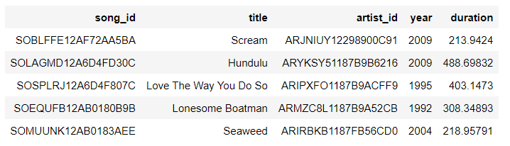

# Project: Data Warehouse

## Contents

+ [Project Discription](#Project-Discription)
+ [Project Datasets](#Project-Datasets)
+ [ETL Process](#ETL-Process)
+ [Project Files](#Project-Files)
+ [How To Run](#How-To-Run)

---

### Project Discription

In this project I built an ETL pipeline that extracts data from Amazon's S3, staged them in Redshift, and transformed data into a set of dimensional tables for analytics team to continue finding insights into what songs users are listening to. 

---

## Project Datasets

* Song data: 's3://udacity-dend/song_data'  
* Log data: 's3://udacity-dend/log_data'

---

### ETL Process

Each Data set was copied into a table created in the Redshift Cluster, and then these tables were used to insert values into the Star schema, so that the data can be ready for analysis later.

---
### Database 
The database design schema consists of the following tables:

#### Staging_events Table

Staging table contains the data copied from the S3 log data

#### Staging_songs Table

Staging table contains the data copied from the S3 song data

#### Songplay Table

This is the fact table for the Star Schema that will be used for analysis

#### Songs Table

Contains details on songs from song files

#### Artists Table

Contains details on artist from song files

#### Users Table

Contains data on sparkify users derived from log files

#### Time Table

Contains a list of timestamps and converted time data from log files

---

### Project Files 
This project consists of the following files:
+ `sql_queries.py` - This file contains Postgres SQL queries in string formate. 
+ `create_tables.py` - This script uses the sql_queries.py file to create new tables or drop old tables in the database.
+ `etl.py` - This script is used to build ETL processes which will read every file contained S3 bucket, copy its data into tables in the Redshift Cluster, then insert its values into the Star Schema using variables in sql_queries.py file.
+ `dwh.cfg` - This File contains the IAM role ARN, the path to S3 Datasets and the Redshift Cluster configurations.

---

### How To Run

Firstly, you need to create IAM Role that has read access to S3 bucket, then you need to create the Redshift Cluster and assosiate the IAM role to it. After that, u need to fill in the IAM role ARN and the Redshift Cluster configurations into the `dwh.cfg` file. Finally run `create_tables.py` file to drop and create the tables and then run `etl.py` to insert the data into the tables

